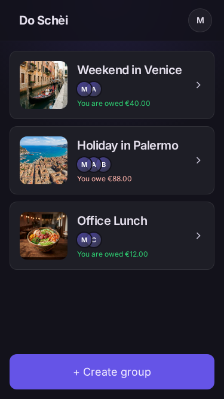
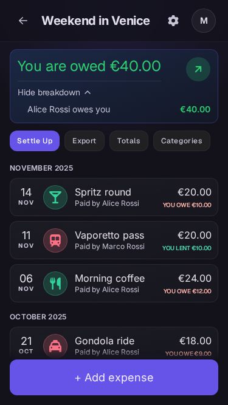
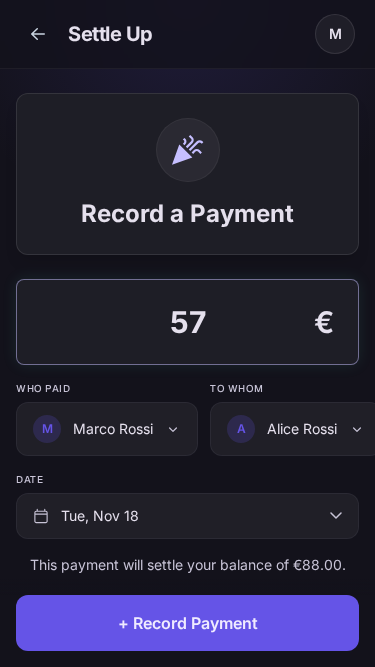
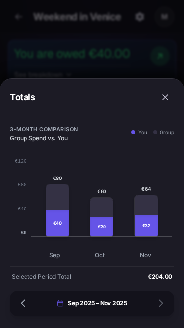

# Do Schèi

  

  <strong>Shared expenses without the spreadsheet.</strong>

  Track what you spend, split it fairly, and always know who owes whom.

  

---

Somebody always pays for the group.

One person books the hotel, another covers dinner, a third fills the tank
— and by the end of the trip nobody remembers who is up and who is down.

**Do Schèi keeps that score for you.**

Create a group, record expenses as you go, choose how they should be split,
and get a clear running balance for everyone. When it's time to settle up,
you know exactly who needs to pay whom — no spreadsheet required.

> *Do schèi* is Venetian for "a couple of coins" —
> the kind of money you don't want to fall out over.

## Screenshots

  
  
  
  

## Features

### Keep everyone in sync

- **Shared groups** — Invite people by email, even before they sign up.
- **Clear balances** — See at a glance how much you owe or are owed.
- **Per-person breakdowns** — Know exactly where every balance comes from.
- **Settle up** — Record payments and keep the history accurate.

### Split expenses your way

- **Equal splits** — Divide an expense evenly.
- **Partial splits** — Include only the people who actually shared it.
- **Exact amounts** — Enter precisely what each person owes.
- **Percentages** — Split expenses by percentage.
- **Quick shortcuts** — Two-person groups get one-tap options for common splits.

### Understand your spending

- **Smart categories** — Categories are suggested from what you type and
  informed by the group's history.
- **Monthly totals** — Compare three months of group spending side by side.
- **Your share** — See your own contribution within each month's total.
- **CSV export** — Take your data with you.

### Make it yours

- Profile and group pictures
- Multi-language interface
- Exact balances with no drifting cents

## Documentation

| Document | Description |
| --- | --- |
| [Development guide](docs/development.md) | How to run and work on the project |
| [Specification](docs/specifications.md) | The canonical product specification |
| [Architecture decision records](docs/adr/README.md) | Why things are the way they are |
| [Contribution methodology](AGENTS.md) | The process for making changes |
| [Changelog](CHANGELOG.md) | What shipped when |

## License

Released under the [MIT License](LICENSE).
